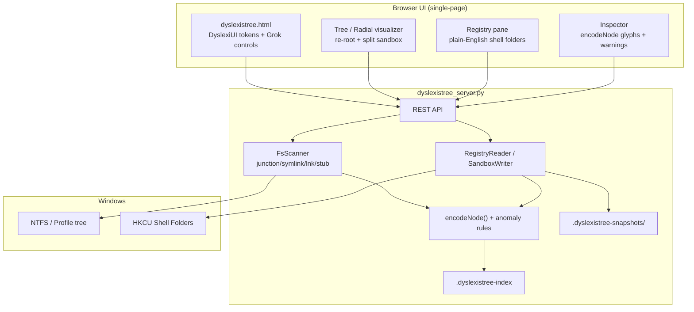
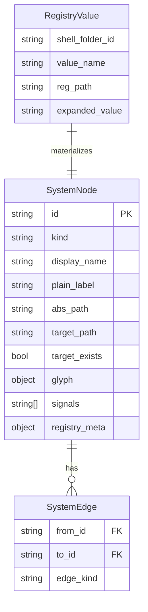
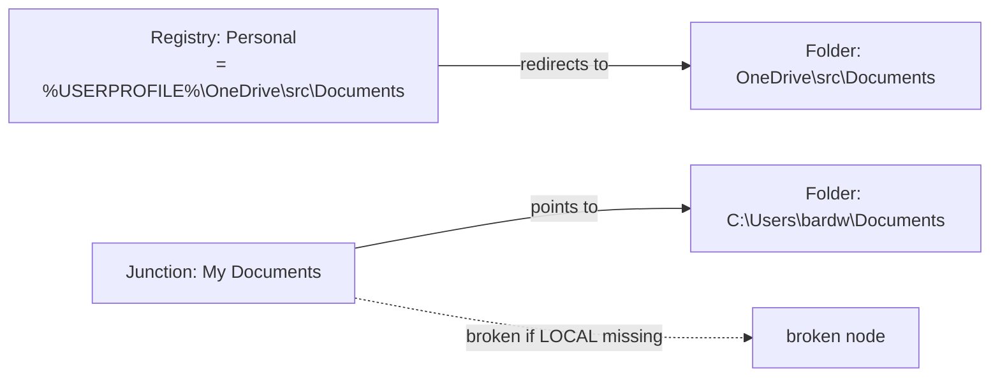
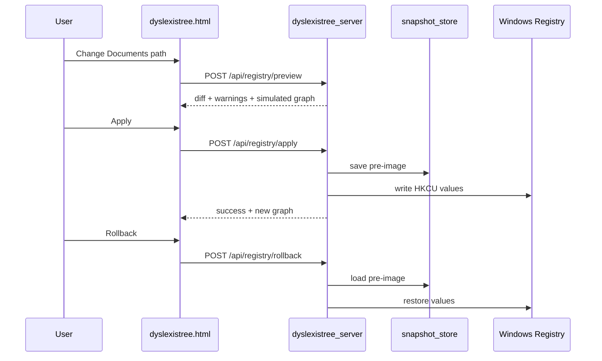

# Dyslexistree — Dyslexia-Aware Windows System Tree Explorer

| Field | Value |
|-------|-------|
| **Project** | Dyslexistree (Sesefus Suite lineage) |
| **Codename** | Dyslexistree |
| **Author** | TBD — assign named owner before PR-1a merge |
| **Date** | 2026-06-21 |
| **Status** | Draft (revision 3 — post re-review `6c22687c`) |
| **Review** | `C:\Users\bardw\.hermes\plans\dyslexistree-review-6c22687c.md` |
| **Parent repos** | `intuitree`, DyslexiUI, odyssey-cockpit `gui-dyslexia-encode`, Grok dyslexia layer |
| **Design ID** | `6c22687c` |

---

## Overview

**Dyslexistree** unifies four existing dyslexia- and navigation-first systems into a single **local-first Windows desktop explorer** that makes filesystem indirection and shell-folder registry redirects legible to novices. It inherits Intuitree's scope-aware tree enumeration and planned re-rooting radial visualizer, DyslexiUI's reading-stress reduction typography and controls, odyssey-cockpit's multi-channel visual encoding (shape + stroke + lane, never color-only), and the Grok dyslexia layer's bionic reading, mouse ruler, focus mode, and localStorage presets.

The motivating incident (session 2026-06-21) exposed a `C:\Users\bardw` profile containing **10 required Windows junctions**, **MobaXterm fake symlink stub files**, **OneDrive Known Folder Move (KFM) drift**, **511 `.lnk` shortcuts**, and **intentional dev junctions** — all indistinguishable in Explorer, Cursor, and raw `dir` output. Regedit offers no visualization, no plain language, no undo, and no safe sandbox for "what if I point Desktop back to a local folder?"

Dyslexistree proposes a **re-rootable radial/tree hybrid** over the union of filesystem nodes and registry shell-folder edges, with a **novice-safe Registry pane** that maps `HKCU\...\User Shell Folders` to concepts like "Where Windows looks for your Documents," supports before/after preview, sandboxed apply, and one-click rollback. All labels, warnings, and inspector copy follow DyslexiUI principles. All node glyphs follow `encodeNode()` multi-channel rules.

---

## Background & Motivation

### Lineage & source artifacts

| Source | Path | What we inherit |
|--------|------|-----------------|
| **Intuitree** | `C:\Users\bardw\git\intuitree\` | `intuitree_server.py` HTTP API, `index_tree.html` hierarchical visualizer, `.intuitree_notes.json`, git branch injection |
| **Intuitree design spec** | `C:\Users\bardw\Favorites\git\intuitree\intuitree_re-rooting_radial_visualizer_design_spec.md` | Click-to-re-root, radial starburst, Relate/Staged Fork modes, split-view sandboxing (README) |
| **DyslexiUI** | `C:\Users\bardw\git\dyslexiui.zip` → `DESIGN.md`, `dyslexia-chat-wrapper.html` | Lexend typography, warm paper palette, spacing dials, no motion, brand-agnostic local-first |
| **gui-dyslexia-encode** | `C:\Users\bardw\Favorites\git\odyssey-cockpit\map\gui\gui-dyslexia-encode.md` | `encodeX() → DrawGlyph` pure functions; ≥2 non-color channels per marker |
| **Grok dyslexia layer** | `C:\Users\bardw\.grok\grok-build-dyslexia-layer.html` | Bionic reading, reading guide (mouse ruler), focus mode, tab multiplexing, `localStorage` presets |

### Current state (Intuitree)

`intuitree_server.py` today:

- Scans `SCAN_ROOT = abspath(join(dirname(__file__), ".."))` — i.e. **parent of repo** (`C:\Users\bardw\git`), not `%USERPROFILE%`
- Classifies nodes using legacy field `type` ∈ {`directory`, `file`, `repository`, `branch_local`, `branch_remote`, `virtual_note`}
- Serves `GET /api/tree`, `POST /api/notes`, `POST /api/extend`
- Persists notes in `.intuitree_notes.json`
- **Does not** detect junctions, symlinks, `.lnk`, fake stubs, or registry redirects
- **Does not** implement re-rooting (hierarchical tree expand/collapse only; no breadcrumb stack)
- **Does not** implement radial visualizer (spec exists)
- **Does not** implement `.intuitree-index` or incremental indexing — README describes these as aspirational; every `GET /api/tree` full-scans (G8 is greenfield)

### Observed pain points (2026-06-21 profile audit)

Quantified findings from `C:\Users\bardw`:

| Anomaly class | Count / example | User impact |
|---------------|-----------------|-------------|
| Windows profile junctions | 10 at profile root (`Application Data`, `My Documents`, `Local Settings`, …) | Look like folders; novices edit/delete the wrong thing |
| MobaXterm fake stubs | `Desktop`, `MyDocuments`, `LauncherFolder` — text files containing `!<symlink>/drives/...` | Not real links; break tools expecting symlinks/junctions |
| OneDrive KFM drift | Desktop/Documents/Pictures → `OneDrive\src\...`; `Documents` folder missing | Broken `My Documents` junction; shell confusion |
| `.lnk` shortcuts | ~511, mostly under `AppData\Roaming\Microsoft\Windows\Recent` | Noise when workspace = entire home directory |
| Intentional dev junctions | `.grok\skills\leadlogic\references` → git repos | Indistinguishable from system junctions without encoding |
| Registry shell folders | `HKCU\Software\Microsoft\Windows\CurrentVersion\Explorer\User Shell Folders` | Invisible in filesystem tree; regedit is hostile |

**User intent stated:** reject OneDrive redirection for shell folders; restore local paths; understand the graph without becoming a Windows internals expert.

### Why a new amalgam (not patches to Explorer/regedit)

1. **Cognitive load:** Dyslexic and novice users need reduced visual noise, plain language, and stable spatial layout — none of which Windows provides.
2. **Graph nature:** Shell folders form a **bipartite graph** (registry values → filesystem paths → junction targets). Flat lists hide cycles and broken edges.
3. **Safe experimentation:** Registry edits are irreversible in practice; split-view sandbox + rollback is mandatory.
4. **Encoding discipline:** Node types must be distinguishable without relying on color (co-occurring dyslexia + colorblindness).

---

## Goals & Non-Goals

### Goals

| ID | Goal | Success signal |
|----|------|----------------|
| G1 | Visualize Windows profile + shell-folder graph as re-rootable tree/radial | User reaches any node in ≤5 clicks from profile root |
| G2 | Classify and encode ≥8 node kinds with ≥2 non-color channels each | SF-DYS-001 smoke: no type identifiable by color alone |
| G3 | Plain-English registry pane for User Shell Folders | Zero raw GUID/HKCU strings in primary UI |
| G4 | Detect and surface anomalies (orphan junction, fake stub, KFM drift, missing target) | Anomaly banner on profile open; per-node scope signals |
| G5 | Sandboxed registry apply with preview + rollback | Every write preceded by diff; rollback ≤1 click |
| G6 | DyslexiUI reading layer on all text surfaces | Lexend default; spacing dials; no motion |
| G7 | Local-first, privacy-first | No telemetry; data never leaves machine except user-initiated export |
| G8 | Incremental indexing via **new** `.dyslexistree-index` | Stale mtime/hash triggers subtree refresh; stub SHA-256 cache hit |

### Non-Goals (v1 / MVP phases)

| ID | Non-Goal | Rationale |
|----|----------|-----------|
| NG1 | macOS / Linux support | Windows shell-folder model is the pain driver |
| NG2 | Full registry editor (arbitrary keys) | Scope limited to shell folders + related Explorer keys |
| NG3 | OneDrive sync management | Detect drift only; do not become a sync client |
| NG4 | Mobile / responsive layout | Desktop-first; large canvas for radial view |
| NG5 | Git write operations beyond Intuitree existing branch create | Dyslexistree focus is Windows profile graph |
| NG6 | Real-time FS watch (ReadDirectoryChangesW) | Phase 9+ (hardening); MVP uses on-demand + manual rescan |
| NG7 | Enterprise AD / roaming profile administration | Single-user HKCU scope |

---

## Proposed Design

### High-level architecture



### Module layout (target repo structure)

```
C:\Users\bardw\git\intuitree\
├── intuitree_server.py              # import/delegate shim (PR-10)
├── dyslexistree_server.py             # extended server (PR-1a+)
├── dyslexistree.html                  # main UI (PR-3+)
├── requirements.txt                   # pywin32 (Windows); optional extras (PR-2)
├── lib/
│   ├── fs_scanner.py                  # junction/symlink/lnk/stub detection (PR-1a)
│   ├── registry_shell.py              # read/map/apply shell folders (PR-6, PR-8)
│   ├── encode_node.py                 # multi-channel glyph model (PR-2)
│   ├── anomaly_detector.py            # scope-signal rules (PR-5)
│   ├── snapshot_store.py              # rollback snapshots (PR-8)
│   └── index_store.py                 # .dyslexistree-index (PR-1b)
├── scripts/
│   └── benchmark_scan.py              # profile scan perf harness (PR-1a)
├── assets/
│   ├── dyslexi-tokens.css             # from DyslexiUI (PR-3)
│   ├── dyslexia-controls.js           # prefs + Grok import (PR-3)
│   ├── glyphs.svg                     # SVG sprite library (PR-2)
│   └── radial-viz.js                  # canvas radial (PR-9)
├── tests/
│   ├── test_fs_scanner.py
│   ├── test_encode_node.py
│   ├── test_anomaly_detector.py
│   └── test_api_compat.py             # type/kind dual emit (PR-1a)
├── docs/
│   └── dyslexistree-design-6c22687c.md
├── .dyslexistree-index/               # runtime, gitignored
└── .dyslexistree-snapshots/           # runtime, gitignored
```

### Unified graph model

Filesystem and registry are merged into one **SystemGraph**:



**Node kinds (`kind` enum, canonical):** API emits **both** `kind` (new) and `type` (legacy) through PR-10 — see [API schema migration](#api-schema-migration-type--kind).

| Kind | Legacy `type` | Detection | Plain label example |
|------|---------------|-----------|---------------------|
| `folder` | `directory` | `os.path.isdir` + not reparse point | "Real folder" |
| `junction` | *(new)* | reparse tag `IO_REPARSE_TAG_MOUNT_POINT` | "Junction — shortcut folder" |
| `symlink` | *(new)* | reparse tag `IO_REPARSE_TAG_SYMLINK` | "Symlink — pointer folder" |
| `lnk` | `file` | extension `.lnk` + COM parse | "Shortcut file" |
| `fake_stub` | `file` | small text file matching `^!<symlink>` | "Fake link file (MobaXterm style)" |
| `file` | `file` | regular file | "File" |
| `registry_redirect` | *(new)* | synthetic node from registry | "Windows setting: Documents location" |
| `broken` | *(modifier)* | any link type with missing target | "Broken link — target missing" |
| `repository` | `repository` | `.git` present | "Git repository" |
| `branch_group` | `branch_group` | git branch container | "Git branches" |
| `branch_local` | `branch_local` | local git branch | "Local branch" |
| `branch_remote` | `branch_remote` | remote git branch | "Remote branch" |
| `virtual_note` | `virtual_note` | notes DB virtual node | "Planning note" |

### Multi-channel encoding (`encodeNode`)

Port of `gui-dyslexia-encode` pattern from odyssey-cockpit:

```python
# lib/encode_node.py
def encode_node(node: dict, granularity: str = "default") -> dict:
    """Pure function: node semantics → DrawGlyph (JSON-serializable)."""
```

| Kind | Shape | Stroke weight | Lane / position | SVG sprite (`glyphs.svg`) | Accent fill (optional) |
|------|-------|---------------|-----------------|---------------------------|------------------------|
| `folder` | circle | 1px | tree lane 0 | `sprite-folder` | warm gold |
| `junction` | diamond | 2px | tree lane 1 | `sprite-junction` | amber |
| `symlink` | triangle | 2px dashed | tree lane 1 | `sprite-symlink` | amber |
| `lnk` | rounded rect | 1px | tree lane 2 | `sprite-lnk` | muted |
| `fake_stub` | hexagon | 3px | tree lane 2 | `sprite-warning` | orange |
| `registry_redirect` | double circle | 2px | registry lane | `sprite-registry` | teal |
| `broken` | diamond | 4px | any | `sprite-broken` | desaturated (not red-only) |
| `repository` | circle | 2px | tree lane 0 | `sprite-git` | green |
| `branch_group` | pill rect | 1px dashed | tree lane 3 | `sprite-branches` | green muted |
| `branch_local` | small circle | 1.5px | tree lane 3 | `sprite-branch-local` | green |
| `branch_remote` | small circle | 1.5px dotted | tree lane 3 | `sprite-branch-remote` | blue muted |
| `virtual_note` | dashed circle | 1px | tree lane 4 | `sprite-virtual` | purple muted |

**Rule (from MAP-GUI-09):** every marker exposes **≥2 non-color channels** (shape + stroke, or shape + lane) before optional accent fill. **SVG sprites are the tertiary channel** — emoji may appear decoratively in labels but **do not count** toward SF-DYS-001. Anomaly/broken uses **weight + shape**, not red-only.

### Filesystem scanner (`FsScanner`)

Extends `build_tree_recursive()` in `intuitree_server.py`:

```python
# lib/fs_scanner.py — Windows-specific detection pipeline
def classify_entry(entry: os.DirEntry) -> NodeKind:
    # 1. Reparse point → junction vs symlink (win32 API or ctypes)
    # 2. .lnk → parse via IShellLink (comtypes/pywin32) or fallback metadata-only
    # 3. fake_stub → read first line, match ^!<symlink>
    # 4. Resolve target; set target_exists
    # 5. Attach bootstrap signals[] (PR-1a; see Bootstrap signals table below)
    #    PR-5 anomaly_detector.py extends with cross-node / registry signals
```

**Default scan profile for MVP:**

| Parameter | Default | Notes |
|-----------|---------|-------|
| `scan_root` | `%USERPROFILE%` | **KD-11.** Override via `--scan-root` for Intuitree dev (`parent-of-repo`) |
| `max_depth` | 4 at profile root | **+2 on re-root** (effective depth 6 at focused subtree — matches Intuitree L90) |
| `max_nodes` | 10,000 | Soft cap with "load more" |
| `ignore_dirs` | Intuitree set + `AppData\Local\Temp`, `node_modules` | Tunable |
| `collapse_lnk_recent` | true | Summarize `Recent\*.lnk` **before** parse/count — applied pre-scan |
| `follow_junctions` | **metadata only** | Resolve `target_path`/`target_exists`; **never recurse** outside `scan_root` unless user re-roots there (KD-12) |

**Migration from Intuitree `SCAN_ROOT`:** `dyslexistree_server.py` defaults to `%USERPROFILE%`. Passing `--scan-root ..` (or env `DYSLEXISTREE_SCAN_ROOT`) preserves legacy `C:\Users\bardw\git` dev workflow. Startup log prints active root and warns if not under profile when anomaly scan expected.

**Junction escape rule (KD-12):** When a junction/symlink target resolves outside `scan_root`, emit a **pointer node** with `target_path` metadata and `children: []` — do not traverse external paths. Re-rooting to the target path expands scan under that new root. Prevents path leakage and malicious junction exfiltration.

**Performance target:** profile scan (depth 4, ~8k nodes) in **<3s** on SSD after `collapse_lnk_recent`; incremental rescan of single subtree **<200ms**.

**Performance plan (PR-1a acceptance):**
- `scripts/benchmark_scan.py` runs against `%USERPROFILE%` and records node_count, ms, kinds
- `collapse_lnk_recent` runs **before** `.lnk` COM parse (skips 511 Recent files)
- **pywin32-less fast path:** `.lnk` nodes get `kind: lnk` from extension + size heuristic; COM parse only when inspector opened or `--full-lnk-parse`
- **Disable auto-refresh:** remove `index_tree.html` 10s poll; replace with manual Rescan button + stale-indicator badge (PR-3)
- Backoff: if `node_count > 2000`, no background refresh; user-initiated rescan only

### Registry shell-folder integration

#### Read path (PR-6)

Read-only mapping of well-known shell folders:

| Shell folder ID | Registry value name | Plain label |
|-----------------|---------------------|-------------|
| `Desktop` | `Desktop` | "Where Windows looks for your Desktop" |
| `Personal` | `Personal` | "Where Windows looks for your Documents" |
| `My Pictures` | `My Pictures` | "Where Windows looks for your Pictures" |
| `My Music` | `My Music` | "Where Windows looks for your Music" |
| `My Video` | `My Video` | "Where Windows looks for your Videos" |
| `Favorites` | `Favorites` | "Where Windows looks for your Favorites" |
| `Downloads` | `{374DE290-123F-4565-9164-39C4925E467B}` | "Where Windows looks for your Downloads" |
| `Local AppData` | `Local AppData` | "App data stored on this PC only" |
| `AppData` | `AppData` | "App data that can roam" |

Registry paths (HKCU only for MVP):

- `Software\Microsoft\Windows\CurrentVersion\Explorer\User Shell Folders` (expandable `REG_EXPAND_SZ`)
- `Software\Microsoft\Windows\CurrentVersion\Explorer\Shell Folders` (legacy `REG_SZ`)

Each registry value produces a **`registry_redirect` synthetic node** linked to the resolved filesystem path node (or `broken` if missing).



#### Write path — sandboxed apply (PR-8; requires PR-7 split pane)

**Never raw regedit.** Flow:

1. User selects shell folder in Registry pane
2. User picks new local path (folder picker) or types path with validation
3. **Preview diff** shows:
   - Registry value before → after (plain English + expandable path)
   - Filesystem impact: which junctions will disagree
   - Warning if OneDrive KFM detected
4. User clicks **"Try in sandbox"** → **PR-7 split pane** opens:
   - Left: current graph
   - Right: simulated graph with proposed registry values (no write yet)
5. User clicks **"Apply"** → backend:
   - Creates snapshot in `.dyslexistree-snapshots/{timestamp}/`
   - Writes **both** `User Shell Folders` (REG_EXPAND_SZ) **and** legacy `Shell Folders` (REG_SZ) in sync (KD-15)
   - Optionally runs **Restore local Documents wizard** step (see outcome matrix below)
   - Logs action to local audit JSON
6. **Rollback** restores snapshot (both registry hives); single-click from inspector

#### "Restore local Documents" wizard — outcome matrix (PR-8 acceptance)

Addresses session pain: missing `Documents` folder + broken `My Documents` junction + OneDrive KFM on `Personal`.

| Step | Action | When offered | User-facing label |
|------|--------|--------------|-------------------|
| A | Create `%USERPROFILE%\Documents` if missing | `target_exists == false` | "Create your Documents folder" |
| B | Set `Personal` → `%USERPROFILE%\Documents` in both registry hives | Always in wizard | "Tell Windows to use local Documents" |
| C | Recreate `My Documents` junction → `Documents` | Opt-in; may need elevation (KD-14) | "Fix the My Documents link" |
| D | Detect-only OneDrive KFM warning | Path under `OneDrive\` | "OneDrive is still managing this folder" |

**Recommended path (KD-13):** Wizard presents A → B as default one-click **"Restore local Documents"**; C shown as optional second step with UAC explanation; D is informational only (no OneDrive unlink in v1).



### Anomaly detection (scope-signal engine)

Extends Intuitree README "scope-signal detection" to Windows profile.

#### Bootstrap signals (PR-1a) vs full detector (PR-5)

`signals[]` is populated in **two stages** so PR-3 banner and extended API schema work before `anomaly_detector.py` ships:

| Stage | Owner | Signals emitted | Input |
|-------|-------|-----------------|-------|
| **Bootstrap** | `lib/fs_scanner.py` (`emit_bootstrap_signals()`) | `SIG_STUB`, `SIG_JUNCTION_ORPHAN`, `SIG_FAKE_DESKTOP`, `SIG_PROFILE_JUNCTION` | Per-node `kind`, `target_exists`, `name`, Appendix A list |
| **Full detector** | `lib/anomaly_detector.py` (PR-5) | `SIG_ONEDRIVE_KFM`, `SIG_REG_FS_MISMATCH`, `SIG_JUNCTION_ALIAS`, `SIG_LNK_NOISE` | Cross-node graph, registry union, subtree counts |

**PR-3 anomaly banner** aggregates **bootstrap `signals[]` only** (from `GET /api/tree` walk). Counts update when tree loads; no client-side heuristics. **PR-5** adds `GET /api/anomalies`, "show problems only" filter, and extends banner to full signal set (G4 complete).

#### Signal catalog

| Signal ID | Rule | Severity | Plain message | Stage |
|-----------|------|----------|---------------|-------|
| `SIG_STUB` | `kind == fake_stub` | warning | "This is a text stub, not a real Windows link" | Bootstrap |
| `SIG_JUNCTION_ORPHAN` | junction/symlink + `target_exists == false` | error | "This junction points nowhere" | Bootstrap |
| `SIG_FAKE_DESKTOP` | `name == Desktop` + `kind` in {`file`, `fake_stub`} | error | "Desktop is not a real folder" | Bootstrap |
| `SIG_PROFILE_JUNCTION` | junction + name in [Appendix A](#appendix-a-canonical-profile-junctions) | info | "Required Windows link — do not delete" | Bootstrap |
| `SIG_ONEDRIVE_KFM` | shell folder under `OneDrive\` | info | "OneDrive is managing this folder" | PR-5 |
| `SIG_REG_FS_MISMATCH` | registry path ≠ junction resolution | warning | "Registry and folder disagree" | PR-5 |
| `SIG_JUNCTION_ALIAS` | junction target duplicates another visible node | info | "Same place as another folder — hidden to reduce clutter" | PR-5 |
| `SIG_LNK_NOISE` | >100 `.lnk` in subtree | info | "Shortcut noise — collapsed in view" | PR-5 |

Signals appear as inspector badges (bootstrap from PR-1a), optional tree overlays ("show problems only" — PR-5), and **profile-open anomaly banner** (bootstrap counts PR-3; full counts PR-5).

### Visualization modes

See [unified phase table](#unified-phase-table) for cross-referenced scheduling.

#### Mode A — Hierarchical tree (Phase 2–3, extend `index_tree.html`)

- Keeps current CSS tree for familiarity; migrates to `role="tree"` / `role="treeitem"` (PR-3)
- Adds glyph column (SVG sprites from `glyphs.svg`) + plain kind label
- **Click node → re-root** (PR-4): prune tree to subtree; breadcrumb stack; `GET /api/tree?root=&depth=` with depth bump +2
- **Collapse rules (PR-5):** aggregate `Recent` lnks; collapse `SIG_JUNCTION_ALIAS` nodes at profile root

#### Mode B — Radial starburst (Phase 7 / PR-9, per Intuitree spec)

- Canvas/SVG radial layout from `intuitree_re-rooting_radial_visualizer_design_spec.md`
- Click branch → new center; animate <300ms (respects `prefers-reduced-motion`)
- Registry nodes on **inner ring** (registry lane); filesystem on outer rings
- Concentric "onion" depth rings for hop distance from root
- **Theme (KD-16):** warm-paper DyslexiUI palette is canonical; radial inherits **glyph language** (shape/stroke/lane), not radial spec's dark-terminal `#0d1117` palette
- MVP radial excludes Relate/Staged Fork modes (deferred to Phase 9+ / post-MVP)

#### Split-view sandbox (Phase 5 — **before** registry write)

From Intuitree README split-view sandboxing:

- **PR-7:** minimal side-by-side pane (DOM tree diff, not canvas) — primary = live graph; secondary = simulated registry change
- Gated commit/omit: **Apply** or **Discard** before closing split
- Shared index reads; isolated sandbox state in memory (not written until PR-8 Apply)
- General-purpose: reused for registry preview and future junction-fix preview

### DyslexiUI + Grok reading layer

CSS tokens imported from `dyslexia-chat-wrapper.html` / `DESIGN.md` (full token set in PR-3):

```css
/* assets/dyslexi-tokens.css — excerpt */
:root {
  --bg-primary: #F5F2EB;
  --text-primary: #1E1B16;
  --font-body: 'Lexend', 'OpenDyslexic', 'Comic Sans MS', sans-serif;
  --line-height: 1.8;
  --letter-spacing: 0.04em;
  --word-spacing: 0.08em;
  --measure: 65ch;
  --focus-ring: 3px solid var(--accent);
}
```

**Controls panel** (client-only; no server prefs endpoint):

| Control | Storage key | Default | Source |
|---------|-------------|---------|--------|
| Font size | `dyslexistree.fontSize` | 16px | DyslexiUI |
| Line height | `dyslexistree.lineHeight` | 1.8 | DyslexiUI |
| Letter spacing | `dyslexistree.letterSpacing` | 0.04em | DyslexiUI |
| Word spacing | `dyslexistree.wordSpacing` | 0.08em | DyslexiUI |
| Line width (measure) | `dyslexistree.measure` | 65ch | DyslexiUI |
| Bionic reading | `dyslexistree.bionic` | off | Grok |
| Reading guide (mouse ruler) | `dyslexistree.readingGuide` | off | Grok |
| Focus mode | `dyslexistree.focusMode` | off | Grok |
| High contrast | `dyslexistree.highContrast` | off | Grok |
| No italics | `dyslexistree.noItalics` | off | Grok |
| Theme | `dyslexistree.theme` | `warm-paper` | DyslexiUI |

**Deferred (Phase 7+):** Grok tab multiplexing — out of scope for explorer MVP.

**Grok preset migration (PR-3):** `dyslexia-controls.js` runs one-time import from `localStorage['grok-dyslexia-layer']` if `dyslexistree.migrated` unset; maps known fields; sets `dyslexistree.migrated = true`.

**Motion policy:** `prefers-reduced-motion: reduce` → all transitions 0.01ms (DyslexiUI + Grok). No auto-scroll.

**Typography on tree labels:** bionic applies to inspector and registry pane only (not tree node names — preserves scanability).

#### Accessibility checklist (PR-3 acceptance)

| Requirement | Implementation |
|-------------|----------------|
| Focus visible | `outline: var(--focus-ring); outline-offset: 2px` on all interactive elements (DyslexiUI 3px standard) |
| Tree semantics | `role="tree"`, `role="treeitem"`, `aria-expanded`, `aria-level`, `aria-label` on nodes |
| Keyboard | Arrow keys navigate; Enter re-roots (PR-4); Space toggles expand |
| Screen reader | `plain_label` + `kind` in `aria-label`; SVG sprites `aria-hidden="true"` with text fallback |
| Color | Kind never conveyed by color alone — shape/stroke/lane required |
| Reduced motion | All animations gated on `prefers-reduced-motion` |

### Index & persistence (`.dyslexistree-index`)

**New capability** (not inherited from Intuitree — see G8). Introduced in PR-1b.

```
.dyslexistree-index/
├── manifest.json           # scan_root, timestamp, node_count, dyslexistree_version
├── nodes/{id}.json         # per-node hash, kind, target, signals, mtime
├── registry.json           # last-known shell folder values (both hives)
└── anomalies.json          # aggregated signals
```

**Incremental rescan semantics (PR-1b):**

| Event | Behavior |
|-------|----------|
| `GET /api/tree` (no cache) | Full scan; rebuild index |
| `GET /api/tree?root=&subtree=` | Load cached subtree; refresh nodes where `entry.mtime > cached.mtime` or hash mismatch |
| `POST /api/rescan` | Force invalidate subtree or full index |
| Stub detection | SHA-256 of first 256 bytes; cache hit skips re-read |
| Concurrency | `index_store_lock` (threading.Lock) — same pattern as `notes_db_lock` in `intuitree_server.py` L26 |
| Cache miss / corrupt index | Fall back to full scan; log warning |

- **Notes:** migrate `.intuitree_notes.json` schema compatibly

---

## API / Interface Changes

### REST API (dyslexistree_server.py)

#### Existing (retained)

| Method | Path | Change |
|--------|------|--------|
| `GET` | `/api/tree` | Extended response schema (glyph, kind, signals, registry links) |
| `POST` | `/api/notes` | Unchanged |
| `POST` | `/api/extend` | Unchanged |

#### New endpoints

| Method | Path | Purpose |
|--------|------|---------|
| `GET` | `/api/tree?root={path}&depth={n}&mode={tree\|radial}` | Re-rooted subtree |
| `GET` | `/api/node/{id}` | Full inspector payload |
| `GET` | `/api/registry/shell-folders` | Plain-mapped shell folder list |
| `POST` | `/api/registry/preview` | Body: `{shell_folder_id, new_path}` → diff + simulated graph |
| `POST` | `/api/registry/apply` | Body: `{shell_folder_id, new_path, fix_junction: bool}` |
| `POST` | `/api/registry/rollback` | Body: `{snapshot_id}` |
| `GET` | `/api/snapshots` | List rollback points |
| `GET` | `/api/anomalies` | Aggregated signals |
| `POST` | `/api/rescan` | Body: `{subtree?}` force refresh |

**Removed:** `GET /api/settings` — dyslexia prefs are client-only (`localStorage`); server has no prefs source of truth (KD-17).

#### API schema migration (`type` → `kind`)

| Phase | API behavior | Client behavior |
|-------|--------------|-----------------|
| PR-1a+ | Emit **both** `type` (legacy) and `kind` (canonical) on every node | Prefer `kind`; fall back to `type` |
| PR-3+ | Mapping table enforced server-side | `tests/test_api_compat.py` validates both fields |
| PR-10 | `type` deprecated; still emitted with warning header `X-Dyslexistree-Deprecated: type` | Remove `type` reads |

**Mapping table:**

| Legacy `type` | Canonical `kind` |
|---------------|------------------|
| `directory` | `folder` |
| `file` | `file` (or `lnk` / `fake_stub` after classification) |
| `repository` | `repository` |
| `branch_group` | `branch_group` |
| `branch_local` | `branch_local` |
| `branch_remote` | `branch_remote` |
| `virtual_note` | `virtual_note` |

#### Example node payload (extended)

```json
{
  "id": "node:junction:My Documents",
  "name": "My Documents",
  "plain_label": "Junction — shortcut folder",
  "kind": "junction",
  "type": "directory",
  "abs_path": "C:\\Users\\bardw\\My Documents",
  "target_path": "C:\\Users\\bardw\\Documents",
  "target_exists": false,
  "glyph": {
    "shape": "diamond",
    "stroke_px": 2,
    "stroke_style": "solid",
    "lane": 1,
    "icon": "junction"
  },
  "signals": ["SIG_JUNCTION_ORPHAN", "SIG_REG_FS_MISMATCH"],
  "registry_links": ["registry:Personal"],
  "children": []
}
```

### CLI launcher

```powershell
# Default: profile scan (Dyslexistree)
python dyslexistree_server.py

# Intuitree-compat dev workflow
python dyslexistree_server.py --scan-root (Join-Path $PSScriptRoot '..')
```

| Flag | Default | Description |
|------|---------|-------------|
| `--scan-root` | `%USERPROFILE%` | Profile or custom root; **not** parent-of-repo |
| `--port` | `8000` (auto-increment if busy) | Same behavior as `intuitree_server.py` L17, L385–392 |
| `--bind` | `127.0.0.1` | Loopback only; use `--bind 0.0.0.0` for LAN dev |
| `--max-depth` | 4 | Initial scan depth; +2 on re-root |
| `--no-registry` | false | FS-only mode |
| `--dev-cors` | false | Enable `Access-Control-Allow-Origin: *` (dev only) |
| `--full-lnk-parse` | false | Enable COM `.lnk` parse on scan |

---

## Data Model Changes

### `.intuitree_notes.json` → compatible extension

```json
{
  "notes": { "rel/path": { "notes": "", "status": "" } },
  "virtual_nodes": { "root": [] },
  "dyslexistree": {
    "version": 1,
    "pinned_roots": ["C:\\Users\\bardw"],
    "collapsed_patterns": ["**/Recent/*.lnk"]
  }
}
```

### Snapshot schema (`.dyslexistree-snapshots/{id}/`)

```json
{
  "id": "snap-20260621T143022Z",
  "created_at": "2026-06-21T14:30:22Z",
  "action": "registry_apply",
  "pre_user_shell_folders": {
    "Personal": "%USERPROFILE%\\OneDrive\\src\\Documents"
  },
  "post_user_shell_folders": {
    "Personal": "%USERPROFILE%\\Documents"
  },
  "pre_shell_folders": {
    "Personal": "C:\\Users\\bardw\\OneDrive\\src\\Documents"
  },
  "post_shell_folders": {
    "Personal": "C:\\Users\\bardw\\Documents"
  },
  "wizard_steps_applied": ["create_folder", "set_registry"],
  "audit_note": "User requested local Documents"
}
```

Apply and rollback **always** write/read both `User Shell Folders` and legacy `Shell Folders` atomically.

### Migration strategy

1. **PR-1a:** Add `dyslexistree_server.py` with dual `type`/`kind` fields; default `scan_root=%USERPROFILE%`
2. **PR-1b:** Add `.dyslexistree-index/` alongside existing notes; no breaking changes
3. **PR-3:** `dyslexistree.html` prefers `kind`; falls back to `type` for compat
4. **PR-10:** `intuitree_server.py` becomes import/delegate shim (not OS symlink); README spec-vs-implemented matrix

---

## Alternatives Considered

### Alternative A — PowerShell + WinForms native app

| Pros | Cons |
|------|------|
| Native Windows look; direct registry API | Poor dyslexia typography control; harder radial viz; splits codebase from Intuitree web stack |
| No browser attack surface | WinForms accessibility weaker than semantic HTML + ARIA |

**Rejected:** DyslexiUI single-file HTML philosophy and Intuitree's proven Python HTTP server pattern are faster to ship and easier to audit.

### Alternative B — Extend Cursor/VS Code extension only

| Pros | Cons |
|------|------|
| Meets user where workspace already is | Cannot fix registry; terrifies novices with JSON settings; no sandbox; color-only file icons |
| Lower distribution friction | Tied to editor; not standalone for family members |

**Rejected:** Registry editing and rollback require elevated local backend outside editor sandbox.

### Alternative C — Third-party tools (Link Shell Extension, OneDrive unlink wizard, regedit export)

| Pros | Cons |
|------|------|
| Mature junction creation | No unified graph; no dyslexia layer; no plain language; no anomaly correlation across registry + FS |
| Zero dev cost | Leaves 511 `.lnk` noise and fake stubs invisible |

**Rejected:** Toolchain fragmentation reproduces the exact confusion Dyslexistree targets.

### Alternative D — WSL/Linux-first profile tool

**Rejected:** Pain is Windows-specific (junctions, HKCU shell folders, MobaXterm stubs on NTFS).

---

## Security & Privacy Considerations

| Topic | Approach |
|-------|----------|
| **Telemetry** | None. No external network calls except optional Google Fonts CDN (self-host Lexend in PR-3). |
| **API keys / secrets** | N/A — no cloud API in core product |
| **Registry writes** | HKCU only; never HKLM without explicit elevation story (non-goal v1) |
| **Path traversal** | All FS ops validate `abspath(child).startswith(scan_root)` — extend `intuitree_server.py` `create_folder` guard |
| **Junction escape** | Resolve external targets as metadata-only pointer nodes; never recurse outside `scan_root` (KD-12) |
| **Snapshot storage** | Local only; may contain paths — warn before export |
| **Elevation** | Junction create/fix may require admin; UI explains why; offer manual instruction fallback (KD-14) |
| **Audit log** | Append-only local JSON for registry apply/rollback |
| **CORS / bind** | Default: bind `127.0.0.1`, CORS **deny**. `--dev-cors` enables `*` for local dev only. Registry POST endpoints never enable wildcard CORS |

---

## Observability

| Signal | Mechanism |
|--------|-----------|
| Scan duration | Server logs `[SCAN] root=... nodes=N ms=...` |
| Node counts by kind | `/api/anomalies` + manifest.json |
| Registry apply/rollback | Audit log + snapshot id |
| Client errors | `console.error` + optional local download of debug bundle (user-initiated) |
| Performance | Target: P95 scan <3s, re-root render <300ms, registry preview <500ms |
| Benchmark | `scripts/benchmark_scan.py` output committed to `docs/benchmarks/` (PR-1a) |

**No remote metrics.** Optional future: local rotating log file `dyslexistree.log` max 5MB.

---

## Unified phase table

Single source of truth for phase numbering across Visualization, Rollout, and PR Plan.

| Phase | Week | PRs | Deliverable | Visualization mode |
|-------|------|-----|-------------|-------------------|
| 0 — Foundation | 1 | PR-1a, PR-1b, PR-2 | Classified profile JSON + glyphs + index | — |
| 1 — Readable UI | 2 | PR-3 | DyslexiUI shell, accessibility, anomaly banner | — |
| 2 — Tree navigation | 2–3 | PR-4 | Click-to-re-root, breadcrumbs, depth bump | Mode A (partial) |
| 3 — Anomaly collapse | 3 | PR-5 | SIG rules, `.lnk` + junction-alias collapse | Mode A (complete) |
| 4 — Registry read | 3–4 | PR-6 | Shell-folder graph union | Mode A + registry pane |
| 5 — Split sandbox | 4 | PR-7 | Side-by-side diff pane, commit/omit gating | Split-view |
| 6 — Registry write | 4–5 | PR-8 | Preview, apply, rollback, Restore wizard | Split-view + write |
| 7 — Radial viz | 5–6 | PR-9 | Canvas starburst (no Relate/Fork) | Mode B |
| 8 — Deprecation | 6 | PR-10 | Shim, README matrix, docs | — |
| 9 — Hardening | ongoing | — | Self-hosted fonts, elevation helper, export | — |

---

## Rollout Plan

Phases map 1:1 to [unified phase table](#unified-phase-table) above.

### Phase 0 — Foundation (week 1)

- PR-1a: FS scanner core + `dyslexistree_server.py` + dual `type`/`kind` API
- PR-1b: `index_store.py` + incremental rescan
- PR-2: `encodeNode` glyph library + `requirements.txt`
- Deliverable: `python -m json.tool` dump of classified `%USERPROFILE%` tree

### Phase 1 — Readable explorer (week 2)

- PR-3: DyslexiUI tokens + dyslexistree.html + accessibility + anomaly banner
- Deliverable: Novice opens profile, sees plain labels and problem summary banner

### Phase 2–3 — Tree navigation + anomalies (week 2–3)

- PR-4: Tree re-root + breadcrumb + `GET /api/tree?root=`
- PR-5: Anomaly detector + collapse rules
- Deliverable: G1 satisfied for tree mode; filter problems only

### Phase 4–6 — Registry (week 3–5)

- PR-6: Registry reader + graph union
- PR-7: Split-pane sandbox (before write)
- PR-8: Registry apply + rollback + Restore local Documents wizard
- Deliverable: User restores local Documents with rollback

### Phase 7–8 — Advanced viz + deprecation (week 5–6)

- PR-9: Radial re-rooting MVP
- PR-10: Deprecate intuitree entrypoints; README spec matrix

### Phase 9 — Hardening (ongoing)

- Self-hosted fonts, elevation helper for junction repair, export/share graph as PNG + plain list

---

## Open Questions

1. **Elevation UX:** Separate elevated helper process vs inline UAC prompt? *(Blocks PR-8 wizard step C only; A/B work without elevation.)*
2. **OneDrive unlink:** Guided unlink workflow deferred — detect-only in v1 (KD-13). Revisit Phase 9+.
3. **Radial vs tree default:** Tree default through Phase 6; radial opt-in toggle after PR-9 (KD-16).
4. **Scan scope when Cursor workspace = home directory:** Default collapse (`collapse_lnk_recent` + `SIG_JUNCTION_ALIAS`); opt-in "show all shortcuts" expands Recent meta-node (KD-7).

---

## References

| Artifact | Path |
|----------|------|
| Intuitree server | `C:\Users\bardw\git\intuitree\intuitree_server.py` |
| Intuitree UI | `C:\Users\bardw\git\intuitree\index_tree.html` |
| Intuitree README | `C:\Users\bardw\git\intuitree\README.md` |
| Re-rooting spec | `C:\Users\bardw\Favorites\git\intuitree\intuitree_re-rooting_radial_visualizer_design_spec.md` |
| DyslexiUI design | `C:\Users\bardw\git\dyslexiui.zip` → `DESIGN.md` |
| DyslexiUI wrapper | `C:\Users\bardw\git\dyslexiui.zip` → `dyslexia-chat-wrapper.html` |
| gui-dyslexia-encode | `C:\Users\bardw\Favorites\git\odyssey-cockpit\map\gui\gui-dyslexia-encode.md` |
| Grok dyslexia layer | `C:\Users\bardw\.grok\grok-build-dyslexia-layer.html` |
| Session pain points | User profile audit 2026-06-21 (`C:\Users\bardw`) |

---

## Key Decisions

| # | Decision | Rationale |
|---|----------|-----------|
| KD-1 | **Extend Intuitree repo in-place** rather than new repo | Shared server patterns, notes DB, Sesefus lineage; lower friction |
| KD-2 | **Python HTTP server + single-page HTML** over native WinForms | Matches Intuitree + DyslexiUI auditable single-file philosophy |
| KD-3 | **`encodeNode()` pure functions** porting gui-dyslexia-encode | Ensures shape+stroke+lane discipline for node types |
| KD-4 | **HKCU-only registry writes with mandatory snapshot rollback** | Minimizes blast radius; novices need undo |
| KD-5 | **Unified SystemGraph** merging registry + filesystem | Shell folder confusion is inherently a graph problem |
| KD-6 | **Tree view MVP before radial** | `index_tree.html` exists; radial deferred to **Phase 7 (PR-9)** per [unified phase table](#unified-phase-table) |
| KD-7 | **Collapse `.lnk` Recent noise by default** | 511 shortcuts overwhelmed user when workspace = home |
| KD-8 | **DyslexiUI warm-paper default theme** | Replaces Intuitree dark terminal aesthetic for reading surfaces |
| KD-9 | **Local-first, zero telemetry** | Registry/path data is highly sensitive |
| KD-10 | **Fake MobaXterm stub as first-class `fake_stub` kind** | Directly addresses observed profile corruption class |
| KD-11 | **Default `scan_root = %USERPROFILE%`** | Surfaces motivating profile anomalies; `--scan-root` for Intuitree dev |
| KD-12 | **Junction targets outside scan_root: metadata only** | Security: no recurse/external scan; user re-roots to expand |
| KD-13 | **Restore local Documents wizard: A+B default, C opt-in** | Registry + folder creation satisfies core intent; junction fix optional with elevation |
| KD-14 | **Junction repair via optional elevated helper** | Inline UAC or small `dyslexistree_elevate.exe` — TBD in PR-8; manual instructions as fallback |
| KD-15 | **Dual registry hive sync on apply/rollback** | Both `User Shell Folders` and `Shell Folders` written atomically |
| KD-16 | **Warm-paper canonical; radial inherits glyphs not dark palette** | Resolves radial spec vs DyslexiUI theme conflict |
| KD-17 | **Dyslexia prefs client-only (`localStorage`)** | No `GET /api/settings`; matches DyslexiUI/Grok model |
| KD-18 | **Retain git branch injection when repos found under scan_root** | Profile scan may include `git\`; strip would regress Intuitree compat |
| KD-19 | **Split sandbox is general-purpose** | PR-7 infrastructure reused by PR-8 registry preview and future junction preview |
| KD-20 | **`pywin32` optional; metadata-only `.lnk` default** | `requirements.txt` documents Windows dep; fast path without COM |

### Packaging (`requirements.txt`, PR-2)

```
# requirements.txt
pywin32>=306; sys_platform == "win32"
```

CI runs tests on Windows runner for full `.lnk` parse; Linux CI uses metadata-only path.

---

## PR Plan

### PR-1a: `feat(dyslexistree): FS scanner core + server bootstrap`

| Field | Value |
|-------|-------|
| **Phase** | 0 |
| **Dependencies** | None |
| **Files** | `lib/fs_scanner.py`, `dyslexistree_server.py` (new), `scripts/benchmark_scan.py`, `tests/test_fs_scanner.py`, `tests/test_api_compat.py`, `.gitignore` |
| **Description** | Port `build_tree_recursive` to `FsScanner`; detect junction, symlink, `fake_stub`, `.lnk` (metadata-only); populate `target_path`, `target_exists`, `kind` + legacy `type`; **`emit_bootstrap_signals()`** on every node (`SIG_STUB`, `SIG_JUNCTION_ORPHAN`, `SIG_FAKE_DESKTOP`, `SIG_PROFILE_JUNCTION`); default `scan_root=%USERPROFILE%`; junction metadata-only rule; extend `GET /api/tree`; bind `127.0.0.1`; benchmark harness |
| **Acceptance** | `benchmark_scan.py` on `%USERPROFILE%` <3s with collapse; dual `type`/`kind` on all nodes; **every classifiable node has `signals[]` (may be empty)**; bootstrap signals present on stub/orphan/desktop/profile-junction fixtures in `tests/test_fs_scanner.py` |

### PR-1b: `feat(dyslexistree): Index store + incremental rescan`

| Field | Value |
|-------|-------|
| **Phase** | 0 |
| **Dependencies** | PR-1a |
| **Files** | `lib/index_store.py`, `dyslexistree_server.py`, `tests/test_index_store.py` |
| **Description** | `.dyslexistree-index/` with mtime/hash staleness; `index_store_lock`; cache hit/miss paths; `POST /api/rescan` |
| **Acceptance** | Subtree rescan <200ms on warm cache; corrupt index falls back to full scan |

### PR-2: `feat(dyslexistree): encodeNode multi-channel glyph model`

| Field | Value |
|-------|-------|
| **Phase** | 0 |
| **Dependencies** | PR-1a |
| **Files** | `lib/encode_node.py`, `assets/glyphs.svg`, `requirements.txt`, `tests/test_encode_node.py` |
| **Description** | `encode_node()` per MAP-GUI-09 for all kinds including branch/virtual; SVG sprites (no emoji channel); attach `glyph` to every API node; SF-DYS-001 smoke |
| **Acceptance** | No kind identifiable by color alone; git/virtual glyphs present |

### PR-3: `feat(dyslexistree): DyslexiUI shell + accessibility + anomaly banner`

| Field | Value |
|-------|-------|
| **Phase** | 1 |
| **Dependencies** | **PR-1a, PR-1b, PR-2** |
| **Files** | `dyslexistree.html`, `assets/dyslexi-tokens.css`, `assets/dyslexia-controls.js` |
| **Description** | Lexend self-hosted; full DyslexiUI tokens (word-spacing, measure dial); Grok toggles (bionic, ruler, focus, highContrast, noItalics); `role="tree"` + keyboard plan; SVG glyph column; remove 10s auto-refresh; **profile-open anomaly banner** aggregating **bootstrap `signals[]`** from `GET /api/tree` (no client heuristics); Grok preset import |
| **Acceptance** | G6 + accessibility checklist; banner shows bootstrap SIG counts on profile open when `signals[]` non-empty; full G4 filter deferred to PR-5 |

### PR-4: `feat(dyslexistree): Tree re-root + breadcrumb navigation`

| Field | Value |
|-------|-------|
| **Phase** | 2 |
| **Dependencies** | PR-3 |
| **Files** | `dyslexistree.html`, `dyslexistree_server.py`, `tests/test_reroot.py` |
| **Description** | Click node → re-root; breadcrumb stack; `GET /api/tree?root={path}&depth={n}` with depth +2 on re-root; Enter key re-root; satisfies **G1 for tree MVP** |
| **Acceptance** | Reach any depth-4 node in ≤5 clicks; breadcrumb undo |

### PR-5: `feat(dyslexistree): Anomaly detector + noise collapse`

| Field | Value |
|-------|-------|
| **Phase** | 3 |
| **Dependencies** | PR-1a, PR-2 |
| **Files** | `lib/anomaly_detector.py`, `dyslexistree.html`, `tests/test_anomaly_detector.py` |
| **Description** | `anomaly_detector.py` **extends** bootstrap signals with cross-node/registry rules; collapse Recent `.lnk` + `Application Data` alias; `GET /api/anomalies`; "show problems only" filter; banner upgraded to full signal set |
| **Acceptance** | G4 filter + collapse complete; `SIG_ONEDRIVE_KFM`, `SIG_REG_FS_MISMATCH`, `SIG_JUNCTION_ALIAS`, `SIG_LNK_NOISE` on fixtures; banner uses `GET /api/anomalies` |

### PR-6: `feat(dyslexistree): Registry shell-folder reader + graph union`

| Field | Value |
|-------|-------|
| **Phase** | 4 |
| **Dependencies** | PR-1a, PR-5 |
| **Files** | `lib/registry_shell.py`, `dyslexistree_server.py`, `dyslexistree.html` (registry pane) |
| **Description** | Read both registry hives; emit `registry_redirect` nodes; link to FS paths; `SIG_REG_FS_MISMATCH`, `SIG_ONEDRIVE_KFM`; `GET /api/registry/shell-folders` |
| **Acceptance** | G3: zero raw HKCU strings in primary UI |

### PR-7: `feat(dyslexistree): Split-pane sandbox infrastructure`

| Field | Value |
|-------|-------|
| **Phase** | 5 |
| **Dependencies** | PR-3, PR-6 |
| **Files** | `assets/split-sandbox.js`, `dyslexistree.html` |
| **Description** | Minimal side-by-side DOM tree panes; primary vs simulated graph; commit/omit gating; **no canvas/radial** — unblocks PR-8 registry preview |
| **Acceptance** | Split opens from registry pane "Try in sandbox"; Discard closes without write |

### PR-8: `feat(dyslexistree): Registry sandbox apply + rollback + Restore wizard`

| Field | Value |
|-------|-------|
| **Phase** | 6 |
| **Dependencies** | **PR-6, PR-7** |
| **Files** | `lib/snapshot_store.py`, `lib/registry_shell.py`, `dyslexistree_server.py`, `dyslexistree.html` |
| **Description** | `POST /api/registry/preview|apply|rollback`; dual-hive snapshots; Restore local Documents wizard (A+B default, C opt-in); audit log |
| **Acceptance** | G5: preview in split pane → apply → rollback restores both hives |

### PR-9: `feat(dyslexistree): Radial re-rooting MVP`

| Field | Value |
|-------|-------|
| **Phase** | 7 |
| **Dependencies** | PR-4, PR-3 |
| **Files** | `assets/radial-viz.js`, `dyslexistree.html`, `docs/radial-layout.md` |
| **Description** | Canvas radial starburst; warm-paper theme; click-to-re-root; **excludes** Relate/Staged Fork modes; reuses PR-4 re-root API |
| **Acceptance** | Radial toggle works; <300ms transition with reduced-motion fallback |

### PR-10: `chore(dyslexistree): Deprecate intuitree entrypoints + docs`

| Field | Value |
|-------|-------|
| **Phase** | 8 |
| **Dependencies** | PR-1a through PR-8 minimum |
| **Files** | `README.md`, `intuitree_server.py` (import shim), `docs/dyslexistree-design-6c22687c.md`, `index_tree.html` (compat redirect) |
| **Description** | `intuitree_server.py` imports/delegates to `dyslexistree_server.py` (no OS symlink); README **Implemented / Planned / Dyslexistree** matrix; port/scan_root migration notes; deprecate `type` field |
| **Acceptance** | README accurately reflects spec vs shipped |

---

## Appendix A: Canonical profile junctions

Windows 10/11 profile-root junctions for `SIG_PROFILE_JUNCTION` (verify on target build):

| Junction name | Typical target | Notes |
|---------------|----------------|-------|
| `Application Data` | `%USERPROFILE%\AppData\Roaming` | Collapse via `SIG_JUNCTION_ALIAS` |
| `Cookies` | `%USERPROFILE%\AppData\Local\Microsoft\Windows\INetCookies` | |
| `Local Settings` | `%USERPROFILE%\AppData\Local` | |
| `My Documents` | `%USERPROFILE%\Documents` | Often broken when Documents missing |
| `NetHood` | `%USERPROFILE%\AppData\Roaming\Microsoft\Windows\Network Shortcuts` | |
| `PrintHood` | `%USERPROFILE%\AppData\Roaming\Microsoft\Windows\Printer Shortcuts` | |
| `Recent` | `%USERPROFILE%\AppData\Roaming\Microsoft\Windows\Recent` | `.lnk` noise source |
| `SendTo` | `%USERPROFILE%\AppData\Roaming\Microsoft\Windows\SendTo` | |
| `Start Menu` | `%USERPROFILE%\AppData\Roaming\Microsoft\Windows\Start Menu` | |
| `Templates` | `%USERPROFILE%\AppData\Roaming\Microsoft\Windows\Templates` | |

---

*End of design document `6c22687c` (revision 3).*